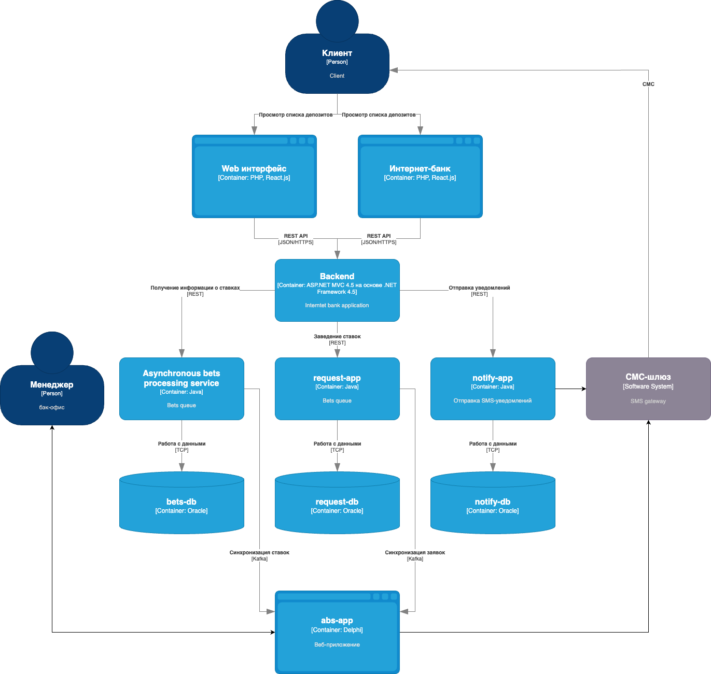

### **Название задачи: Открытие депозитов онлайн** 
### **Автор: Гапонов Н.**
### **Дата: 23.05.2025**
### **Функциональные требования**
Опишите здесь верхнеуровневые Use Cases. Их нужно оформить в виде таблицы с пошаговым описанием:

| **№** | **Действующие лица или системы**         | **Use Case**                    | **Описание**                                                                                       |
| :---: | ---------------------------------------- | ------------------------------- | -------------------------------------------------------------------------------------------------- |
|   1   | Интернет-банк, Сервис ставок             | Отображение списка депозитов    | Интернет-банк запрашивает актуальные ставки по депозитам у Сервиса ставок и отображает их клиенту. |
|   2   | Клиент, Интернет-банк                    | Заполнение формы заявки         | Клиент выбирает депозит, указывает счёт и сумму.                                                   |
|   3   | Интернет-банк, Сервис заявок на депозиты | Передача данных в сервис заявок | Интернет-банк передаёт данные заявки в Сервис заявок на депозиты.                                  |
|   4   | Сервис заявок на депозиты                | Валидация данных                | Сервис проверяет корректность данных (например, наличие средств на счёте).                         |
|   5   | Сервис заявок на депозиты, АБС           | Передача заявки в АБС           | Сервис передаёт заявку в АБС для дальнейшей обработки.                                             |
|   6   | Клиент, Сервис уведомлений               | Подтверждение заявки СМС-кодом  | Клиент получает СМС-код для подтверждения заявки и вводит его в интернет-банке.                    |
|   7   | Менеджер бэк-офиса, АБС                  | Обработка заявки менеджером     | Менеджер бэк-офиса обрабатывает заявку в АБС.                                                      |
|   8   | АБС, Клиент                              | Отправка уведомления клиенту    | АБС отправляет СМС-уведомление клиенту о статусе заявки.                                           |

### **Нефункциональные требования**
Опишите здесь нефункциональные требования и архитектурно-значимые требования.

| **№** | **Требование**                                                                                |
| :---: | --------------------------------------------------------------------------------------------- |
|   1   | Время отклика системы для всех операций должно быть не более 500 мс.                          |
|   2   | Доступность системы должна составлять 99,9% (uptime).                                         |
|   3   | Система должна выдерживать до 1000 одновременных запросов на открытие депозитов.              |
|   4   | Все данные, передаваемые между системами, должны быть зашифрованы (HTTPS, TLS).               |
|   5   | Система должна быть документирована для дальнейшего расширения и поддержки.                   |
|   6   | Использование промежуточного слоя между интернет-банком и АБС для снижения нагрузки на АБС.   |
|   7   | Интернет-банк должен поддерживать горизонтальное масштабирование (добавление новых серверов). |
|   8   | Использование существующих технологий (MS SQL, Oracle) для минимизации затрат.                |

### **Решение**
Приведите диаграммы контекста и контейнеров в модели C4. Опишите там основные компоненты и интеграции всех элементов решения. 

Context: 

---

Container: 

---

В процессе разработки архитектуры решения для открытия депозитов я придерживался ряда принципов и логики, принимая во внимание как функциональные, так и нефункциональные требования:

1. Функциональные требования
Интернет-банк: Этот компонент должен быть максимально простым и интуитивно понятным для пользователей. Мы выбрали ASP.NET MVC из-за его надежности, чтобы минимизировать риски и ускорить процесс разработки.
Сервис обработки заявок на депозиты: Он отвечает за обработку заявок и их передачу в АБС, и мы решили использовать Java Spring Boot.
Сервис уведомлений: Для отправки СМС-уведомлений также применён Java Spring Boot.
Сервис ставок: Хранение ставок в АБС на базе Oracle позволяет избавиться от ручных процессов и повысить точность данных.

2. Нефункциональные требования
Производительность:
- Использование кэширования для быстрого доступа к справочным данным.
- Оптимизация запросов к базе данных (MS SQL, Oracle).
Масштабируемость:
- Возможность увеличения количества серверов интернет-банка.
Безопасность:
- Шифрование данных (HTTPS, TLS).
- Использование промежуточного слоя для ограничения доступа к АБС.
Поддерживаемость:
- Применение известных технологий (MS SQL, Oracle) для сокращения расходов на обучение.
- Подготовка документации для будущего расширения системы.

3. Архитектурно-значимые требования
Промежуточный слой: Прямая интеграция интернет-банка с АБС может перегружать систему, поэтому промежуточный слой помогает снизить нагрузку и повысить надежность.
Шифрование данных: Необходимо для защиты личных данных клиентов.
Горизонтальное масштабирование: Позволяет обеспечивать высокую доступность и производительность с ростом числа пользователей.
Микросервисная архитектура: Способствует упрощению поддержки и масштабирования интернет-банка.

4. Ограничения и риски
Избежание прямой интеграции: Промежуточный слой помогает снизить нагрузку на АБС.
Минимизация изменений: Использование существующих технологий и опыта сотрудников для сокращения затрат и времени реализации.

5. Итоговая логика принятия решений
Минимизация рисков:
- Применение проверенных технологий (ASP.NET, Java Spring Boot).
- Избежание прямой интеграции с АБС.
Обеспечение масштабируемости:
- Увеличение серверов интернет-банка при необходимости.
Обеспечение безопасности:
- Шифрование данных при передаче.
- Переходной слой для ограничения доступа к АБС.

Учет ограничений:
- Применение существующих технологий (MS SQL, Oracle).
- Сокращение доработок у подрядчика.
Обеспечение поддерживаемости:
- Подготовка документации для будущего расширения системы.
- Микросервисная архитектура для упрощения поддержки.

Этот подход позволяет создать минимально жизнеспособный продукт (MVP) для открытия депозитов с минимальными рисками и максимальной эффективностью.

### **Альтернативы**

| №   | Альтернатива                 | Преимущества                                             | Недостатки                                                             | Причина отказа                                             |
| --- | ---------------------------- | -------------------------------------------------------- | ---------------------------------------------------------------------- | ---------------------------------------------------------- |
| 1   | Прямая интеграция с АБС      | - Упрощение архитектуры - Снижение времени разработки | - Высокая нагрузка на АБС - Ограниченная масштабируемость           | Не соответствует требованиям масштабируемости и надёжности |
| 2   | Отсутствие шифрования данных | - Упрощение разработки - Снижение затрат              | - Высокий риск утечки - Несоответствие требованиям безопасности     | Неприемлемо для финансовой системы                         |
| 3   | Монолитная архитектура       | - Упрощение разработки - Меньше накладных расходов    | - Сложность масштабирования - Высокий риск возникновения узких мест | Не соответствует требованиям масштабируемости и поддержки  |
| 4   | Использование другой СУБД    | - Современные технологии - Гибкость                   | - Необходимость переобучения - Риск несовместимости с системами     | MS SQL минимизирует затраты и риски                        |

**Недостатки, ограничения, риски**

1. **Сложность внедрения промежуточного слоя**: Увеличивает время разработки и требует дополнительных ресурсов для поддержки.

2. **Ограничения горизонтального масштабирования интернет-банка**: Требует значительных ресурсов, увеличивает затраты на поддержку.

3. **Ограничения АБС**: Масштабируется только вертикально, что ограничивает производительность и увеличивает стоимость.

4. **Ограничения текущих технологий**: Использование MS SQL и Oracle ограничивает гибкость в выборе решений и требует работы с устаревшими технологиями.

5. **Риск перегрузки АБС**: Может привести к снижению производительности и ограниченной гибкости. Необходимы оптимизация запросов и внедрение механизмов ограничения нагрузки.

6. **Риск задержек в разработке**: Сложная архитектура и интеграции могут задерживать проект, увеличивая затраты. Требуется чёткое планирование и мониторинг прогресса.
