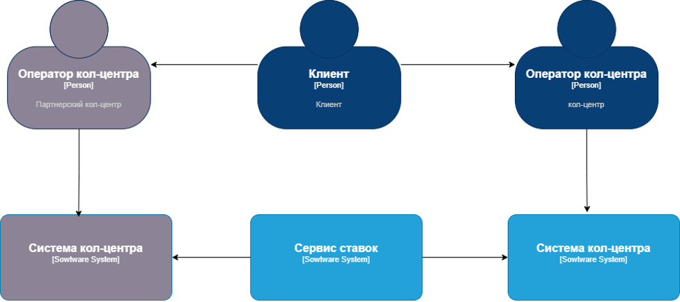
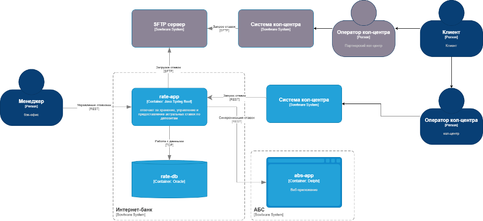

### **Название задачи: Передача ставок в call-центр (далее КЦ)** 
### **Автор: Гапонов Н.**
### **Дата: 23.05.2025**
### **Функциональные требования**

### Предоставление актуальных ставок КЦ:
| **№** | **Действующие лица или системы** | **Use Case**                     | **Описание**                                                          |
| :---: | -------------------------------- | -------------------------------- | --------------------------------------------------------------------- |
|   1   | Сотрудник КЦ, Система КЦ         | Запрос актуальных ставок         | Сотрудник КЦ запрашивает актуальные ставки через интерфейс системы КЦ |
|   2   | Система КЦ, Сервис ставок        | Передача запроса в сервис ставок | Система КЦ отправляет запрос в сервис ставок через API                |
|   3   | Сервис ставок, Система КЦ        | Получение актуальных ставок      | Сервис ставок возвращает актуальные ставки в систему КЦ               |
|   4   | Система КЦ, Сотрудник КЦ         | Отображение ставок               | Система КЦ отображает актуальные ставки сотруднику                    |
|   5   | Сотрудник КЦ, Клиент             | Консультация клиента             | Сотрудник КЦ консультирует клиента по актуальным ставкам              |

### Передача актуальных ставок партнёрскому КЦ:
| **№** | **Действующие лица или системы**          | **Use Case**                  | **Описание**                                                        |
| :---: | ----------------------------------------- | ----------------------------- | ------------------------------------------------------------------- |
|   1   | Сервис ставок                             | Формирование файла с ставками | Сервис ставок формирует файл с актуальными ставками                 |
|   2   | Сервис ставок, SFTP-сервер                | Передача файла через SFTP     | Сервис ставок передаёт файл через SFTP в партнёрский КЦ             |
|   3   | Партнёрский КЦ, SFTP-сервер               | Загрузка файла в систему      | Партнёрский КЦ загружает файл с актуальными ставками в свою систему |
|   4   | Партнёрский КЦ, Сотрудник партнёрского КЦ | Отображение ставок            | Партнёрский КЦ отображает актуальные ставки сотруднику              |

### **Нефункциональные требования**
| **№** | **Требование**                                                        |
| :---: | --------------------------------------------------------------------- |
|   1   | Время отклика сервиса ставок должно быть не более 100 мс              |
|   2   | Передача файла через SFTP должна занимать не более 1 минуты           |
|   3   | Доступность сервиса ставок должна составлять 99,9% (uptime)           |
|   4   | Время восстановления после сбоя (MTTR) должно быть не более 15 минут  |
|   5   | Все данные, передаваемые через SFTP, должны быть зашифрованы          |
|   6   | Доступ к API сервиса ставок должен быть ограничен                     |
|   7   | Сервис ставок должен быть документирован для дальнейшего расширения и | поддержки |
|   8   | Использование SFTP для передачи файлов                                |
|   9   | Реализация API для кол-центра                                         |

### **Решение**
Context: 

---

Container: 

---

При интеграции партнёрского кол-центра в процесс обработки заявок на депозиты я руководствовался следующими принципами:

1. Учёт ограничений: кол-центр работает с файлами через SFTP без API. Это обеспечивает безопасную и надёжную передачу данных.
2. Быстрое внедрение: минимальные затраты и использование SFTP, стандартного решения для банка.
3. Функциональность: передача актуальных ставок через SFTP соответствует требованиям.
4. Соответствие нефункциональным требованиям: безопасность, надёжность, производительность и совместимость обеспечиваются использованием SFTP.
5. Удобство для сотрудников кол-центра: использование привычных технологий упрощает внедрение.
6. Масштабируемость: возможен переход на новые технологии в будущем.
7. Минимизация рисков: автоматизация процессов и меры безопасности снижают возможные риски.

Этот подход позволяет быстро интегрировать кол-центр, минимизируя затраты и риски, а также обеспечивает безопасность данных. В будущем возможно обновление технологий для улучшения скорости и автоматизации.

### **Альтернативы**

|   №   | Метод передачи данных                                 | Преимущества                                                     | Недостатки                                                       |
| :---: | ----------------------------------------------------- | ---------------------------------------------------------------- | ---------------------------------------------------------------- |
|   1   | Использование API для партнёрского кол–центра         | – Обновление данных в реальном времени  – Простота интеграции | Кол–центр не поддерживает API–запросы                            |
|   2   | Использование электронной почты для передачи файлов   | Лёгкость в реализации                                            | – Низкая надёжность передачи  – Риск утечки информации        |
|   3   | Использование облачного хранилища для передачи файлов | Высокая надёжность                                               | – Дополнительные расходы  – Требуется интеграция с API облака |

**Недостатки, ограничения, риски**

|   №   | Недостаток                         | Описание                                                              | Меры                                                                      |
| :---: | ---------------------------------- | --------------------------------------------------------------------- | ------------------------------------------------------------------------- |
|   1   | Задержка в обновлении данных       | Передача файлов через SFTP по расписанию, что может вызвать задержки. | Уменьшение интервала передачи (например, каждые 5 минут).                 |
|   2   | Ограниченная функциональность SFTP | SFTP не поддерживает обновление в реальном времени.                   | Реализация уведомлений об изменениях (например, через Kafka).             |
|   3   | Риск утечки данных                 | Передача файлов через SFTP требует дополнительных мер безопасности.   | – Шифрование файлов перед передачей.  – Регулярный аудит безопасности. |
